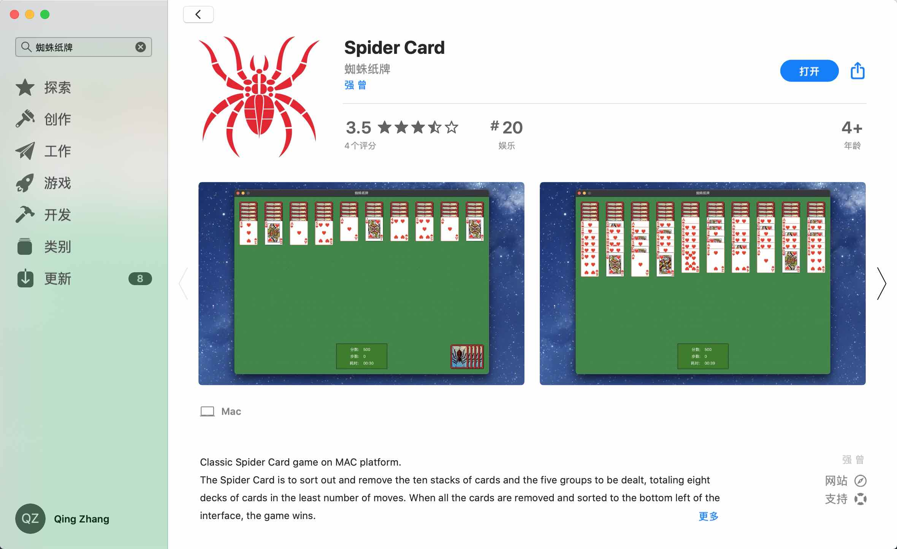
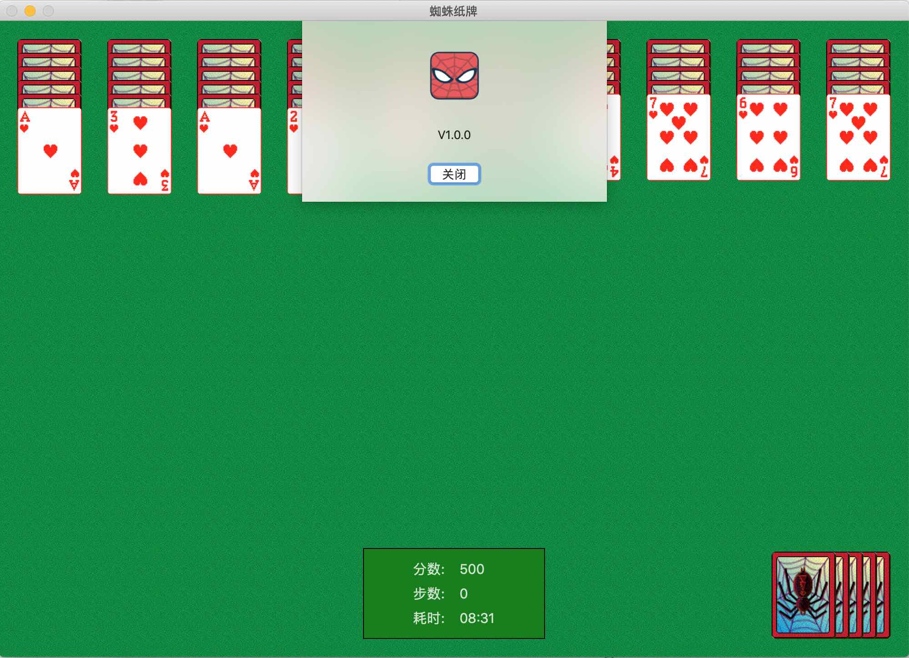
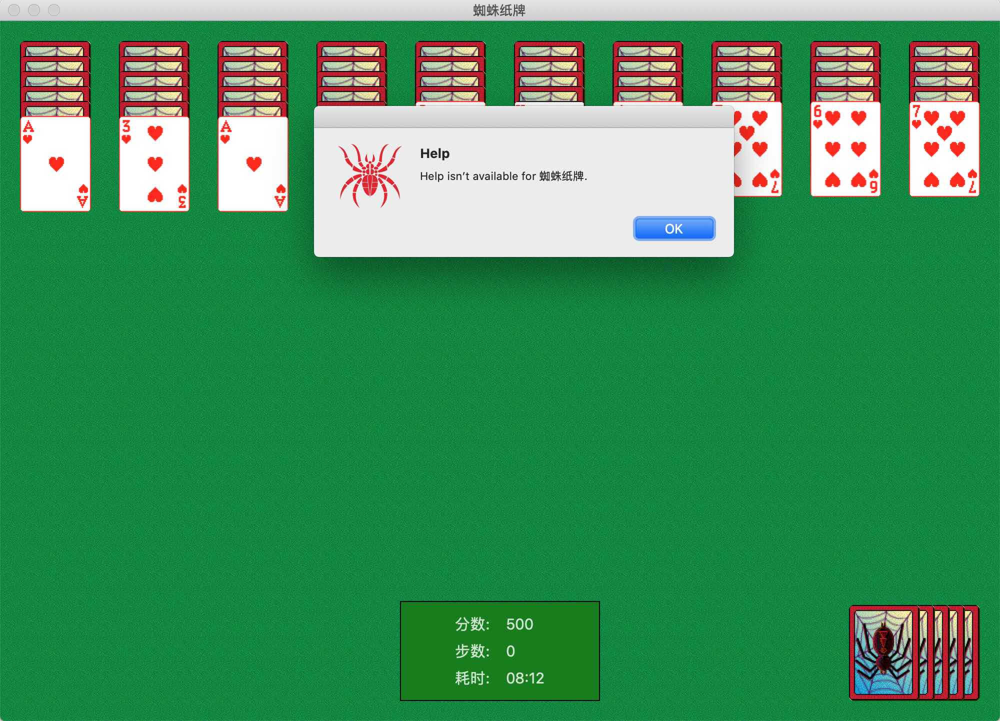
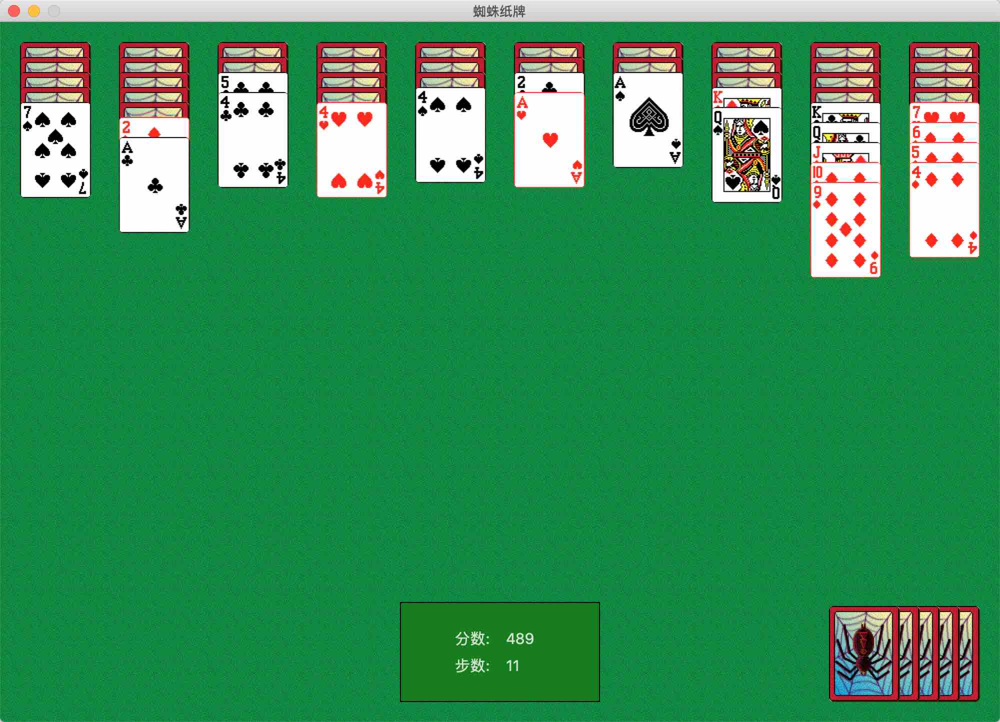
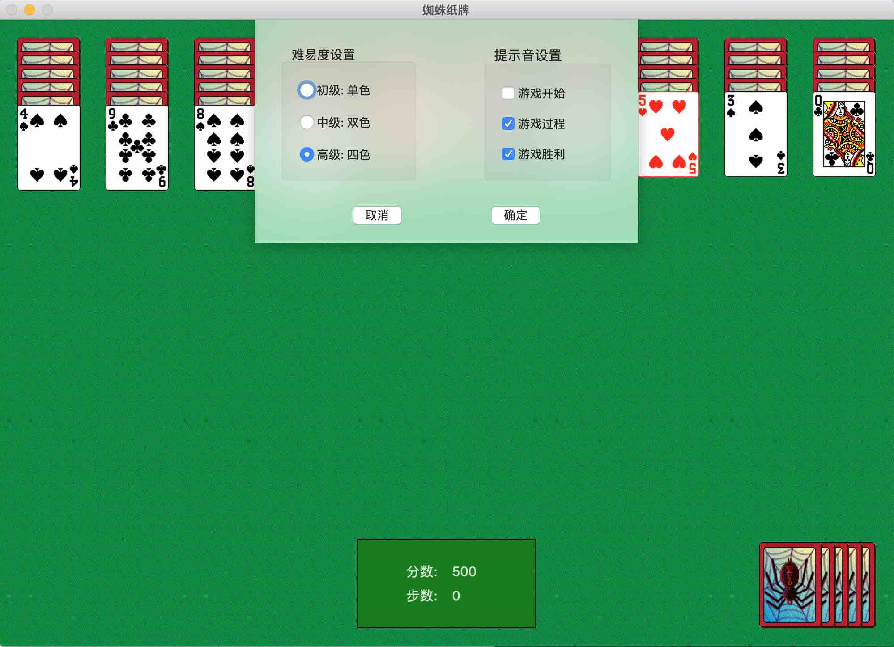
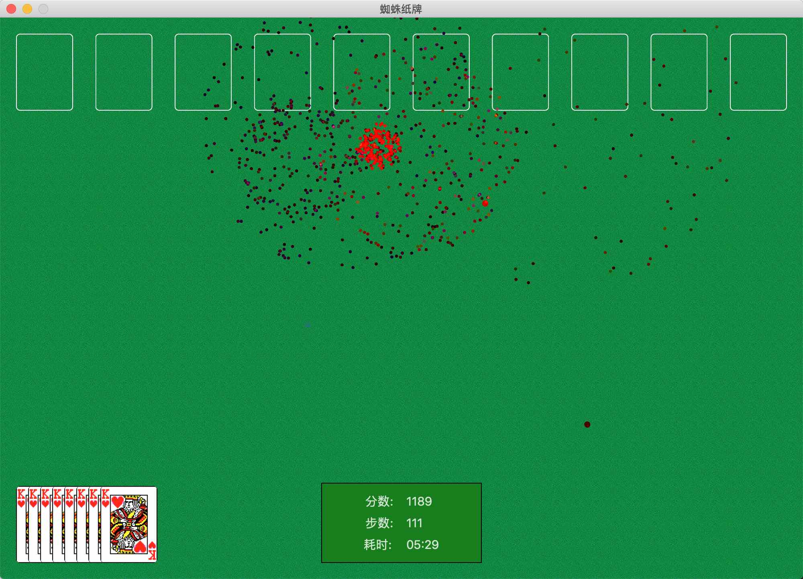

# 蜘蛛纸牌 `for Mac`

仿 `Windows` 经典单机游戏 `蜘蛛纸牌`

## 申明

竟然没想到，如此一个半成品竟然被拿去上架`App Store`了，真是荣幸啊！但是兄弟，你好歹打个招呼啊。
原本只是做出来供大家消遣的，没想到竟然发生这样的事情。
已经添加开源协议，本项目服从`GPL`协议，如果不知道什么是`GPL`请自行百度。

以下是证据：

## 已完成

- [x] 基本游戏功能
- [x] 难易度设置
- [x] 分数、步数显示
- [x] 部分提示音效果
- [x] 提示音设置
- [x] 撤销功能
- [x] 胜利后烟花效果

## 已知问题

- [x] 拖动牌时鼠标释放位置必须是一列排区域内
- [ ] 无法修改窗口大小

## 未完成
- [ ] 发牌等动画效果
- [ ] 耗时统计、最好成绩记录
- [ ] 提示功能

## 游戏截图

## 游戏下载

* `clone` 源码后自行编译运行
* `release` 中下载 `dmg` 文件

## 开源不易，理性打赏

支付宝 | 微信
---|---
 | 

